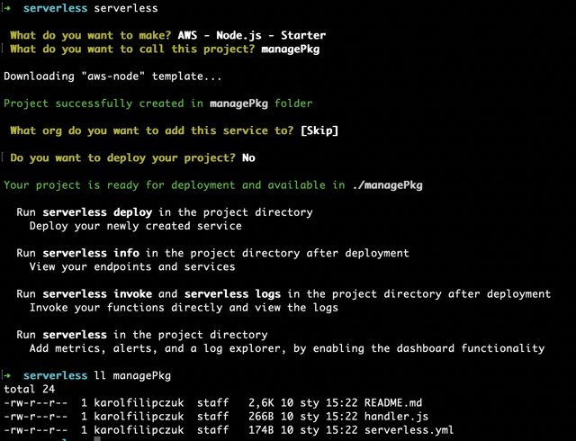
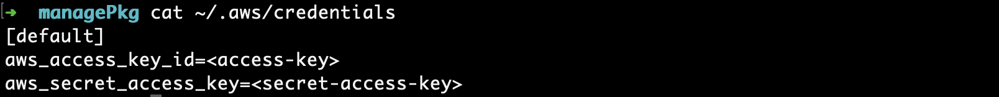
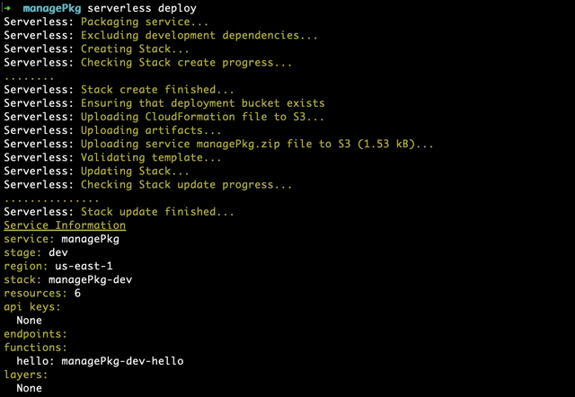
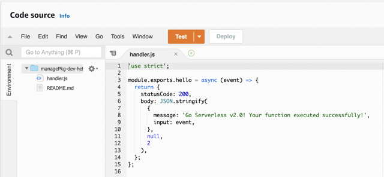
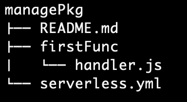
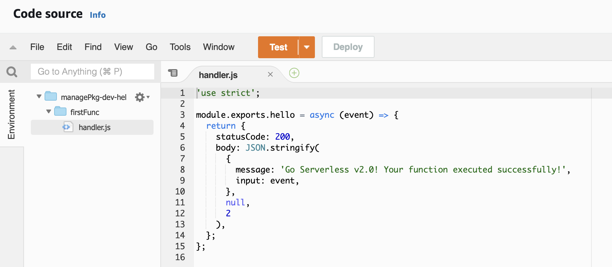
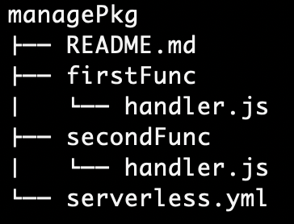
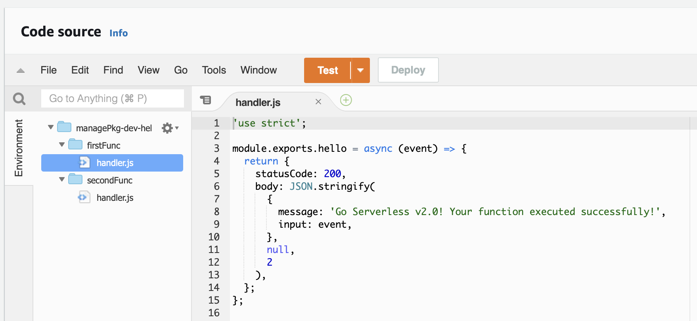
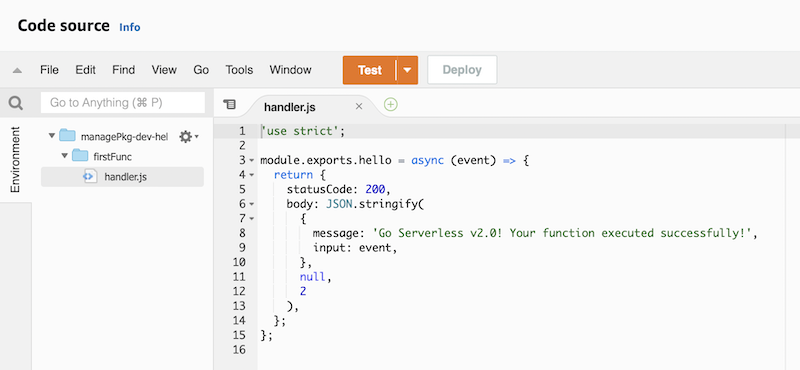
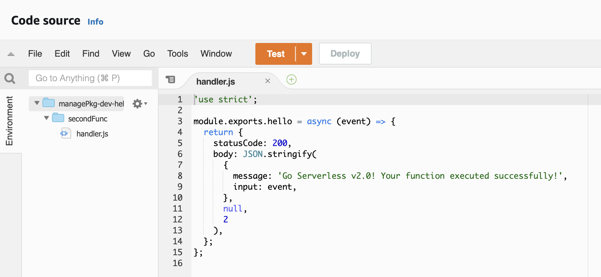

# Serverless
Serverless solutions contsantly get more and more attention. The upward trend most likely will remian for longer period. It's especially benefical for teams which do not want to maintain the underlying infrastructre or want to rapidly develop a proof of concept to confirm the solution. Such an approach is understandable, but it might often go sideways in terms of costs and keeping serverless functions cloud-native.

To get the most out of the serverless you need to keep your function as light and small as possible. The cost of running serverelss functions is tied up to the size of the package and the time of execution. The Serverless framework allows rapid function development, test and deployment. The more function you maintain the more crucial package management becomes. Let me show you how to make sure each function only contain the smallest necessary package. 


## Setup Serverless project
Let begin with setting up a new serverless project. I'm assuming you already have installed the serverless framework. If not, please refer to [the official guide](https://www.serverless.com/framework/docs/getting-started).

Run `serverless` command. The framework will ask for the project settings. Choose `AWS - Node.js - Starter`, choose name for the project (content of project will be placed in the directory with the same name), skip service and do not deploy for now.

You should see similar output in the screen as shown in sreenshot.


<p class="bottom-caption">Serverless Project Init</p>

## Initial project
Initial project has 3 files:
- README.md - a doc with example commands
- handler.js - the lambda function code
- serverless.yml - serrverless configuration

#### handler.js
The example code returns message in JSON format.
```javascript
'use strict';

module.exports.hello = async (event) => {
  return {
    statusCode: 200,
    body: JSON.stringify(
      {
        message: 'Go Serverless v2.0! Your function executed successfully!',
        input: event,
      },
      null,
      2
    ),
  };
};
```

#### serverless.yml
The configuration file specify necessary paramaters for deploying serverless function.

```yaml
service: managePkg

frameworkVersion: '2 || 3'


provider:
  name: aws
  runtime: nodejs12.x
  lambdaHashingVersion: 20201221

functions:
  hello:
    handler: handler.hello
```

The interesting part is in `functions` section. The section desribe each lambda function to be deployed. Currently, only one is defined with the name `hello` and path to function - in our case the javascript file is called `handler` and function is called `hello` therefore handler path is `handler.hello`.

## Deploy project
Since we are using AWS as a cloud provider, we need AWS programmatic user to deploy the project. Serverless can use the AWS credentials stored in `~/.aws/credentials`. Update or create the credential file with correct secret key and secret access key.


<p class="bottom-caption">AWS Credentials</p>

Now we are ready to deploy the serverless project. Run `serverless deploy` command in the project root.

<p class="bottom-caption">Initial deployment</p>

After deployment check the lambda function in AWS Console.

<p class="bottom-caption">Initial lambda</p>
Please note on the left that package contains only `handler.js` and README.md.

## Refactor directory
We have all files now in the root directory which is generally not a good practice. 
Therefore we should introduce better directory structure, place each function is separate directory and manage them in single `serverless.yml`.

<p class="bottom-caption">Directory structure</p>

Update handler in `serverless.yml` to `firstFunc/handler.hello` and exclude `README.md`, since it is not necessary for lambda function.
```yaml
service: managePkg

frameworkVersion: '2 || 3'


provider:
  name: aws
  runtime: nodejs12.x
  lambdaHashingVersion: 20201221

package:
  exclude:
    - README.md

functions:
  hello:
    handler: firstFunc/handler.hello
```
Deploy changes with `serverless deploy`.

<p class="bottom-caption">Lambda after directory structure change</p>

Now we don't have `README.md` in the lambda function package and the handler function is placed inside `firstFunc` directory.

## Second functions
The initial configuration is already done. Usually you will have more than one lambda function in your serverless project. Create a second function in our project and check how it will be deployed in AWS.

Create directory `secondFunc` and copy the `handle.js` from first function. 

<p class="bottom-caption">Directory structure with two functions</p>

Add new function called `helloTwo` in `serverless.yml` pointing to the second function.

```yaml
service: managePkg

frameworkVersion: '2 || 3'


provider:
  name: aws
  runtime: nodejs12.x
  lambdaHashingVersion: 20201221

package:
  exclude:
    - README.md

functions:
  hello:
    handler: firstFunc/handler.hello
  helloTwo:
    handler: secondFunc/handler.hello
```

Deploy the project with `serverless deploy`.

You should now have two lambdas deployed. Open one of them and check the lamdba package.

<p class="bottom-caption">Lambda package with multiple lambda deployed</p>

Although we have deployed two separate lambda function, each of them include all code from the project. Imagine you have 10 or 100 lambdas instead of two. It would introduce unnecessary duplication and increase package size. All of this can be mitigated with correct serverless configuration.

## Serverless configuration for multiple lambda deployment
What we need to do is to tell each lambda which files are necessary for them to run correctly.

Start with excluding all files and directory on global level. Update exclude clause from `README.md` to `"**/*"`.

Then set in the package configuration setting to pacakge each function `individually` to `true`.

At the end, on the function level include the necessary files. It will keep the package as light as possible for each function and gives you easy way to define each function's package content. 


The final configuration should look like:
```yaml
sservice: managePkg

frameworkVersion: '2 || 3'


provider:
  name: aws
  runtime: nodejs12.x
  lambdaHashingVersion: 20201221

package:
  individually: true
  exclude:
    - "**/*"

functions:
  hello:
    handler: firstFunc/handler.hello
    package:
      include:
        - firstFunc/**
  helloTwo:
    handler: secondFunc/handler.hello
    package:
      include:
        - secondFunc/**
```

New configuration change packaging behaviour. Each function is packaged separetely. 
All directories, subdirectories and files in the project root are globally excluded from the package.
Each function has include option which define package content for function. Include option on function level has priority over global exclude option. As a result all files are excluded expect those defined on function level.

You can now deploy the changes with `serverless deploy`.

Each function package contains only bare minimum needed. We have got rid of duplication and reduced size of the pacakge.


<p class="bottom-caption">Lambda package for firstFunc</p>


<p class="bottom-caption">Lambda package for secondFunc</p>

## Conclusion
Serverless solution comes with great advantages - reduced infrastructure maintainance, quicker development, more suitable for cloud native solution and usually are less costly.
You have to properly maintain and mange your serverless solution to get most of those benefits. Keeping your pacakge as light as possible will keep your costs low and reduce latency. It's good practice to configure environment as soon as possible to have starting point for expanding project.

Thanks for reading!